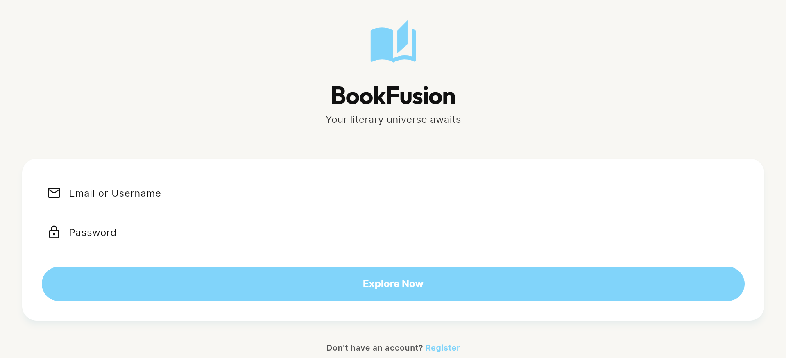
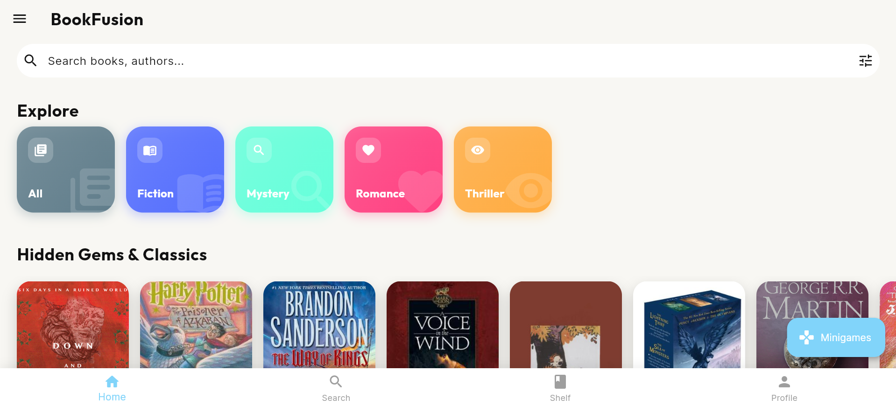
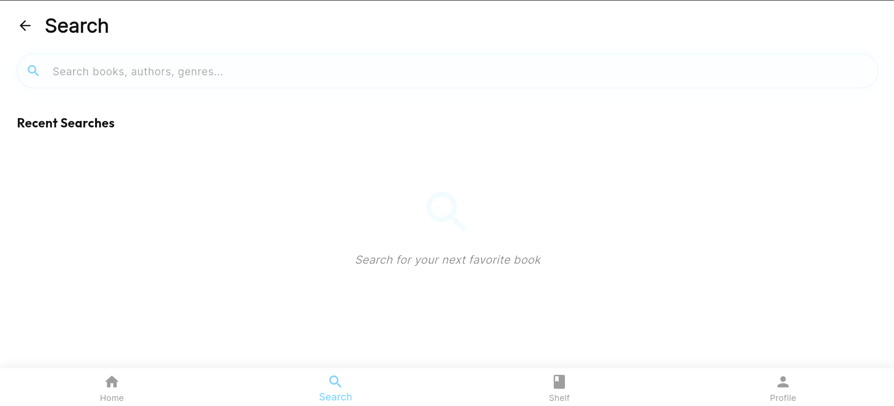
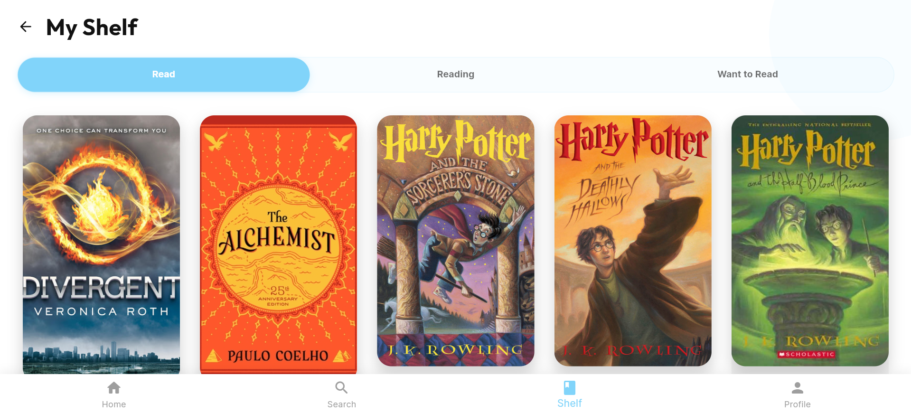
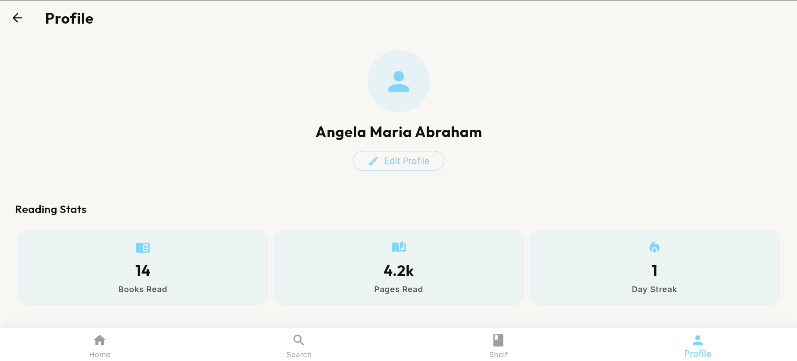
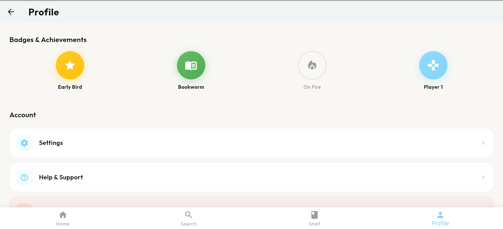

# BookRec 📚

A cross-platform mobile app that transforms book discovery using an on-device TF-IDF recommendation engine, gamified mini-games, and a privacy-first architecture.


---

## 📸 Screenshots

| Login | Home | Search |
|-------|------|--------|
|  |  |  |

| My Shelf | Profile Stats | Badges |
|----------|--------------|--------|
|  |  |  |

---

## About

BookRec goes beyond static lists and rating-based suggestions. Instead of matching genre tags or cover popularity, it analyses the *prose* of book descriptions using NLP to surface books that genuinely match a reader's taste — all without sending any data to an external server.

---

##  Key Features

###  Gamified Discovery
- **Cover Reveal** — Test your visual memory and knowledge of iconic book cover art.
- **Sentence Decryption** — A unique discovery method that challenges you to identify books from prose and writing style, creating a deeper connection to the material.

###  Intelligent Recommendations
- **On-Device TF-IDF Engine** — Uses a custom-built TF-IDF and Cosine Similarity algorithm to match books based on thematic content and plot descriptions.
- **Privacy-First** — All recommendation logic runs locally on your device. No reading data ever leaves the device, ensuring fast performance and superior data privacy.

###  Premium UI/UX
- Dribbble-inspired design with a clean blue and white palette.
- Reading stats, badges & achievements system, Top Shelf profile view.
- Custom squircle shapes and smooth transitions for a high-end feel.

###  Advanced Data Pipeline
A comprehensive Python-based data engineering suite used to clean, validate, and normalise a **10,000-book dataset**, ensuring high-quality metadata and imagery.

---

##  Tech Stack

| Layer | Technology | Purpose |
|-------|-----------|---------|
| Mobile UI | `Flutter (Dart)` | Cross-platform Android & iOS app |
| Recommendation | `TF-IDF · Cosine Similarity` | On-device NLP-based book matching |
| Local Storage | `SQFlite · SharedPreferences` | On-device book data & user prefs |
| Auth & Sync | `Firebase Auth · Firestore` | User login & real-time data sync |
| State Management | `Provider` | Scalable app-wide state |
| Data Pipeline | `Python` | Dataset cleaning, filtering & validation |

---

##  Project Architecture
```
lib/
├── models/      # Data models for Books, Users, etc.
├── providers/   # State management logic (Provider)
├── screens/     # UI screens (Home, Profile, Minigames, Admin)
├── services/    # Core logic (Recommendation Engine, Firebase, Database)
├── theme/       # Design system tokens and styling
└── widgets/     # Reusable UI components
```

### Core Services
- **RecommenderService** — The heart of the app's TF-IDF content-matching logic.
- **MinigamesService** — Logic for Cover Reveal and Sentence Decryption games.
- **DatabaseService** — Manages local data persistence and syncing via SQFlite.

---

##  Data Processing Pipeline

| Script | Purpose |
|--------|---------|
| `analyze_dataset.py` | Exploratory analysis of the raw book dataset |
| `clean_descriptions.py` | Cleans and normalises book description text |
| `deep_clean.py` | Comprehensive deep cleaning of titles and metadata |
| `fix_encoding.py` | Corrects mojibake and character encoding errors |
| `filter_english.py` | Filters dataset to English-language books only |
| `filter_images.py` | Validates and filters books with accessible cover images |
| `filter_no_description.py` | Removes entries with missing or empty descriptions |
| `final_clean.py` | Final pass cleanup before database embedding |
| `inspect_suspicious.py` | Flags suspicious or anomalous entries for review |
| `validate_dataset.py` | Ensures structural integrity and data completeness |
| `eval_recommender.py` | Evaluates recommendation quality on sample inputs |


